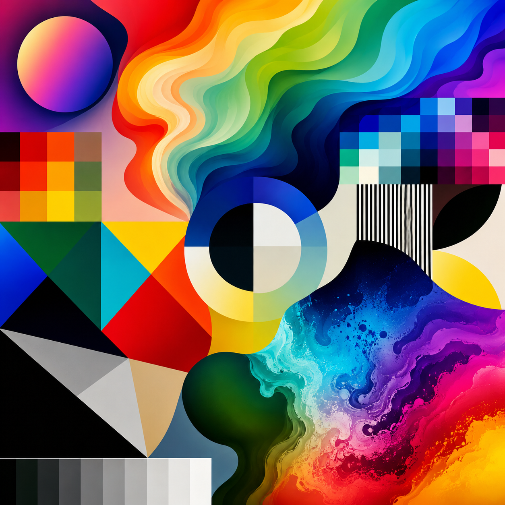
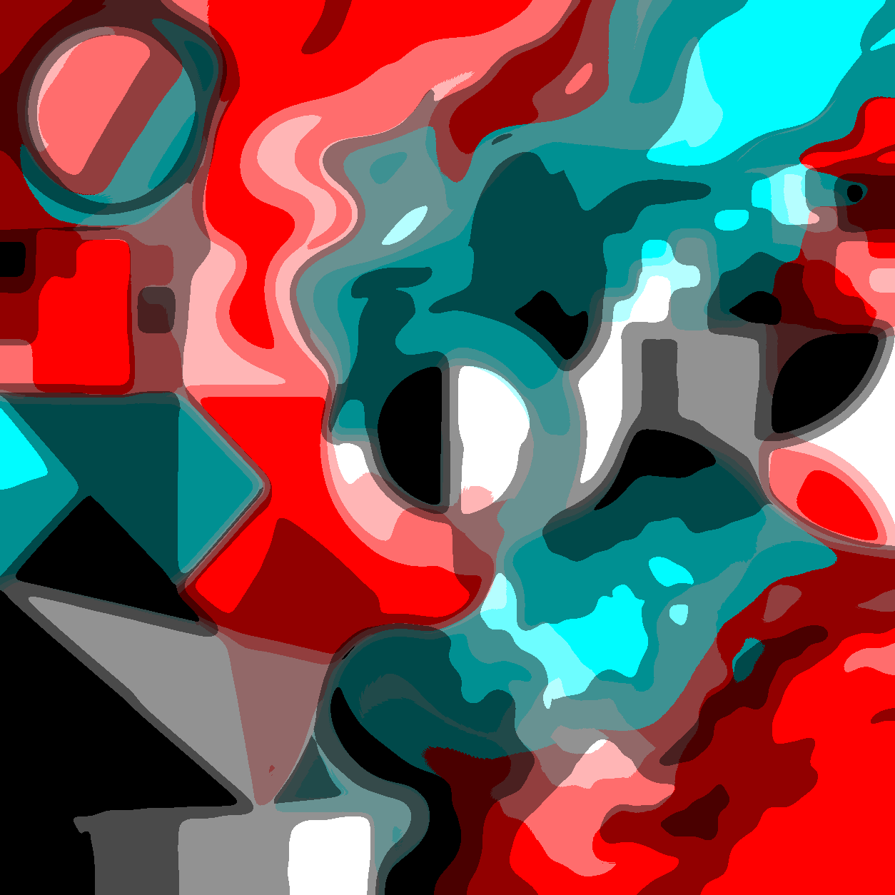
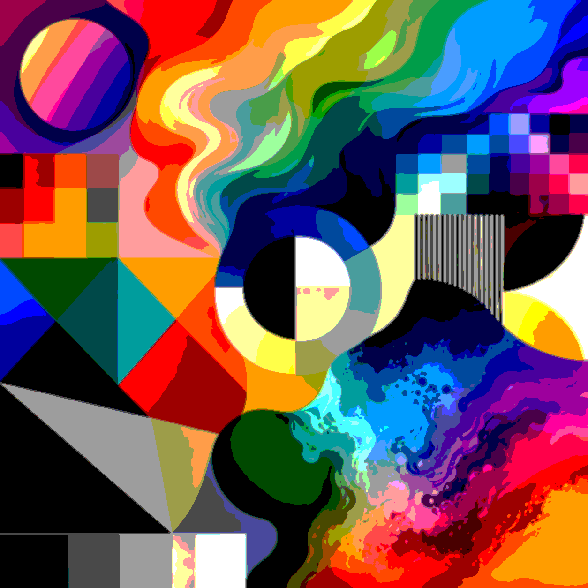
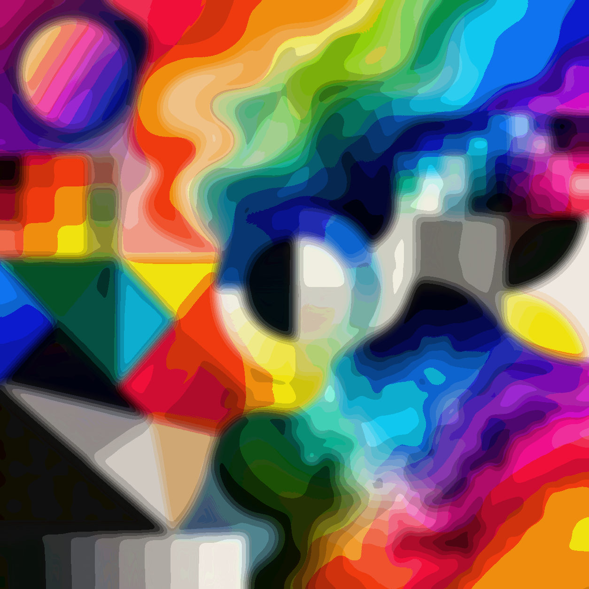

# Threshiator (historical web demonstrator)

A browser-based laboratory for exploring the "Threshiator" effect with advanced PNG metadata embedding capabilities. This prototype focuses on fast iteration for posterization workflows with live histograms, per-channel thresholds, and per-band tonal controls across multiple color spaces. The goal is to nail the feel of the core effect in the browser before porting the logic to other hosts such as G'MIC or Krita.

## Example Output

These examples use [SpectrumBreakpoint.png](SpectrumBreakpoint.png) as the source image and show the same input pushed through different Threshiator settings.

| Source                                                                                | Demo 1                                                            | Demo 2                                                            | Demo 3                                                            |
| ------------------------------------------------------------------------------------- | ----------------------------------------------------------------- | ----------------------------------------------------------------- | ----------------------------------------------------------------- |
|  |  |  |  |

## Features

### Core Functionality

- **Live dual-canvas preview** – Original image and processed output stay visible side-by-side so you can inspect the source while tweaking levels.
- **RGB/HSV histograms with draggable dividers** – Each channel shows a 256-bin histogram sourced from the original image (in the selected posterize space) plus draggable vertical guides to adjust band thresholds.
- **Per-channel level steppers** – Quickly change the number of bands per channel with compact increment/decrement controls.
- **Per-band output sliders** – Each band exposes a 0–255 output slider enabling aggressive tonal remapping, including inverted or duotone looks.
- **Instant feedback loop** – All controls feed directly into the processed canvas; no Apply button required.
- **Synchronize toggle** – Optionally link all channels together and edit a single combined histogram/control stack.
- **Summed histogram view** – When channels are synchronized, the histogram shows the combined distribution for quick global adjustments.
- **Optional alpha posterization** – Enable an Alpha panel and posterize alpha with the same thresholds/bands/outputs as the other channels (leave disabled to preserve source alpha).

### PNG Metadata System

- **Save Image with embedded settings** – Export processed images as PNG files with Threshiator settings embedded as metadata chunks (similar to ComfyUI workflows).
- **Import settings from PNG** – Load Threshiator settings directly from PNG files created by the application.
- **ComfyUI-style workflow embedding** – Settings are stored in PNG tEXt chunks for maximum compatibility and shareability.

### Preset Management

- **Manifest-based preset system** – Both JSON and PNG presets are managed through a simple `manifest.json` file.
- **Built-in presets** – Comic Book, Duotone Blue, Vintage Photo, Noir, and Pop Art effects included.
- **User-extensible presets** – Add your own JSON or PNG presets by updating the manifest file.
- **No code changes required** – Users can add presets without modifying application code.

### File Support

- **Import/Export JSON settings** – Save and load posterize configurations as JSON files.
- **PNG preset discovery** – Automatically loads PNG files with embedded Threshiator metadata.
- **Dual format support** – Seamlessly handles both JSON and PNG preset formats.
- **Sample image + file loader** – The app boots with `test.png` for quick testing and also supports loading your own images through the file picker.

## Tech Stack

- [Vite](https://vitejs.dev/) + TypeScript for the application scaffolding
- Canvas 2D rendering for image processing and histograms
- ESLint + Prettier for linting and formatting
- Vitest for focused unit coverage of the posterize kernel

## Getting Started

```bash
npm install
npm run dev
```

The dev server launches at <http://localhost:5173>. Load an image (or use the default), tweak thresholds and band outputs, and watch the processed canvas update in real time.

### Color Spaces + Alpha

- Use **Posterize Space** to switch between **RGB (R/G/B)** and **HSV (H/S/V)** posterization; the three channel panels map to the selected space.
- Enable **Posterize Alpha** to reveal the Alpha panel; when disabled, alpha remains unchanged.

### Using PNG Metadata

1. **Create your perfect effect** by adjusting posterize settings
2. **Click "Save Image"** to export PNG with embedded settings
3. **Share the PNG file** - anyone can load your exact settings by importing the PNG
4. **Import settings** by clicking "Import Settings" and selecting either `.json` or `.png` files

### Adding Custom Presets

To add your own presets to the dropdown:

**For JSON presets:**

1. Create a JSON file in `/presets/` with this structure:

```json
{
  "name": "My Effect",
  "description": "Description of the effect",
  "settings": {
    /* ExportSettings object */
  }
}
```

2. Add the filename to `jsonPresets` array in `/presets/manifest.json`
3. Refresh the page

**For PNG presets:**

1. Create your effect and save as PNG using "Save Image"
2. Copy the PNG file to `/presets/` folder
3. Add the filename to `pngPresets` array in `/presets/manifest.json`
4. Refresh the page

PNG presets appear with a 📁 folder icon in the dropdown.

## Available Scripts

- `npm run dev` – start the Vite development server
- `npm run build` – produce a production build in `dist/`
- `npm run preview` – preview the production build locally
- `npm run lint` – run ESLint with the TypeScript rule set
- `npm run typecheck` – run TypeScript without emitting files
- `npm run format` – apply Prettier formatting
- `npm run test` – run Vitest unit tests

## Architecture

### PNG Metadata Implementation

- **PNG tEXt chunks** store JSON settings with keyword "Threshiator"
- **CRC32 validation** ensures data integrity
- **ComfyUI-compatible** metadata embedding approach
- **Fallback handling** for PNGs without metadata

### Preset System

- **Manifest-driven** loading from `/presets/manifest.json`
- **Dual format support** for JSON and PNG presets
- **No hardcoded filenames** - fully user-extensible
- **Graceful fallbacks** to built-in presets if manifest fails

## Roadmap Ideas

See [docs/TODO.md](docs/TODO.md) for active cleanup, feature, performance, and porting tasks.

## Contributing / Notes

This repo operates as an interactive sketchpad. Durable project context lives in
[docs/HISTORY.md](docs/HISTORY.md), and current work is tracked in
[docs/TODO.md](docs/TODO.md). Pull requests are welcome, but expect rapid
refactors as the effect firmly takes shape.

## License

Threshiator is free software licensed under the GNU General Public License,
version 3 or, at your option, any later version.

Copyright (C) 2026 Richard Perry.

See [LICENSE](LICENSE) for the complete license terms.
